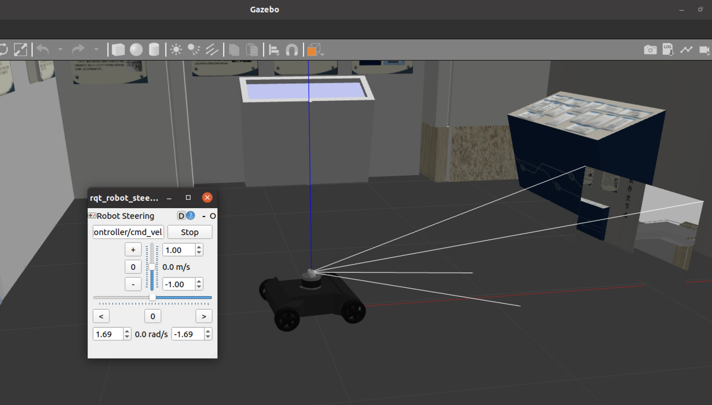

# Gazebo-based Synthetic Multi-modal dataset 


<div align=center></div>


**Test platform**:
           **Ubuntu 20.04 + ros-noetic-desktop-full**

leyuansun@outlook.com 2023.2


## Contents:

#### 	1.Multi-modal dataset

​		Realsense D435: RGB + Depth

​		Velodyne VLP-16: 3D LiDAR point cloud

​		Inertial Measurement Unit (IMU): Linear acceleration + angular velocity. 		

​	    Ground truth trajectory: timestamp + tx + ty + tz + qx + qy + qz + qw


ubuntu 18.04 + ROS Melodic desktop full 


Simulation in Gazebo with ROS, Follow below steps:

Step 1:
```bash
git clone this repository
cd neor_mini/mini_sim18_ws
rosdep install --from-paths src --ignore-src -r -y  
catkin_make                            
```

You can see 2 ROS packages in mini_sim18_ws/src folder,lists:

```bash
neor_mini                 # Storing the description of neor mini's appearance with urdf file
steer_mini_gazebo         # Storing the launch files of neor mini model visual in Gazebo
```


Step 2: launch UGV's launch file, visualize the urdf in Rviz.

```bash
# show the urdf of UGV in Rviz
# plz source devel/setup.bash firstly
cd ~/neor_mini/mini_sim18_ws/src/neor_mini/launch
roslaunch display_gazebo_sensors_VLP16.launch 
```


<div align=center></div>


Step 3: Visualize the urdf in Gazebo and control UGV.

```bash
# show the urdf of UGV in Gazebo and control it using GUI
# plz source devel/setup.bash firstly
cd ~/neor_mini/mini_sim18_ws/src/steer_mini_gazebo/mini_gazebo/launch
roslaunch steer_mini_gazebo steer_mini_sim.launch
```



You can visualize different modalities and ground truth in Rviz by adding topics.


Step 4: Record all modalities and ground truth in the rosbag.

```bash
cd ~/neor_mini/mini_sim18_ws/src/steer_mini_gazebo/mini_gazebo/launch
roslaunch steer_mini_gazebo steer_mini_sim.launch
rosbag record -O bag_file_name /d435/color/image_raw /d435/depth/image_raw /imu/data /velodyne_points /ackermann_steering_controller/odom
```
The recorded bag file includes the following topics.
```bash
topics:      /ackermann_steering_controller/odom      : nav_msgs/Odometry      
             /d435/color/image_raw                    : sensor_msgs/Image      
             /d435/depth/image_raw                    : sensor_msgs/Image      
             /imu/data                                : sensor_msgs/Imu        
             /velodyne_points                         : sensor_msgs/PointCloud2
```

Step 5: Extract modalities from rosbag.

The format of file name is timestamp.`timestr = "%.6f" %  msg.header.stamp.to_sec()`
```bash
python3 extractgt.py                      #extract ground truth trajectory
python3 extractimg.py                     #extract RGB images
python3 extractdepth.py                   #extract 16UC1 depth images
python3 extractimu.py                     #extract angular velocity and linear acceleration in xyz
rosrun pcl_ros bag_to_pcd <*.bag> /velodyne_points <output_directory>  #extract LiDAR point cloud to pcd files
```
You can try to add other sensors and world maps(even dynamic environments) as extending of this repo.


# Acknowledgement
Gazebo world maps:
- [https://github.com/sychaichangkun/ROS-Academy-for-Beginners](https://github.com/sychaichangkun/ROS-Academy-for-Beginners)
- [https://github.com/mlherd/Dataset-of-Gazebo-Worlds-Models-and-Maps](https://github.com/mlherd/Dataset-of-Gazebo-Worlds-Models-and-Maps)

Steer_drive_ros to control the motion of UGV
- [https://github.com/CIR-KIT/steer_drive_ros/tree/kinetic-devel/steer_drive_controller](https://github.com/CIR-KIT/steer_drive_ros/tree/kinetic-devel/steer_drive_controller)

Velodyne VLP-16 3D LiDAR

- [https://github.com/RobotnikAutomation/velodyne_simulator](https://github.com/RobotnikAutomation/velodyne_simulator
)

Realsense D435 for RGB and depth
- [https://github.com/issaiass/realsense2_description](https://github.com/issaiass/realsense2_description)

Framework and UGV model were modified from
- [https://github.com/COONEO/neor_mini/tree/Melodic/mini_sim18_ws/src/neor_mini](https://github.com/COONEO/neor_mini/tree/Melodic/mini_sim18_ws/src/neor_mini
)
